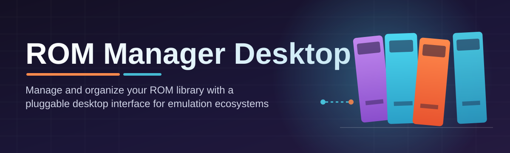
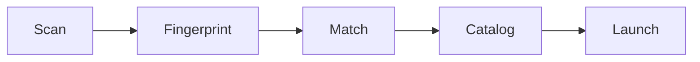

# rom-manager-desktop-suite 🕹️📀

  

*Your ROM library, finally organized like it deserves to be — one desktop suite, zero chaos.*

  

---

## 📦 What This Is NOT

Let's clear the air before anything else, because expectations matter.

This is **not** a ROM downloader, not a torrent client in disguise, and not a shady launcher bundled with browser toolbars. There's no scraping of copyrighted content baked into the app, no shady "get everything" button, and no dark-pattern popups begging for your email. If you came looking for a shortcut to acquiring games, this isn't that project — go look elsewhere.

What **rom-manager-desktop-suite** actually *is*: a clean, purpose-built Windows desktop application for organizing, tagging, verifying, and launching the ROM collections you already own and have legally dumped yourself. Think of it as the librarian your retro-gaming shelf never had — it catalogs, cross-references metadata, checks file integrity, and hands everything off to your emulator of choice with a double-click.

---

## 🔭 Overview

Retro gaming collections have a habit of turning into digital junk drawers. You start with a tidy folder of `.nes` files, and eighteen months later you've got seventeen sub-folders, three different naming conventions, half a dozen duplicate dumps, and no earthly idea which region variant is the "good" one. **rom-manager-desktop-suite** exists to fix exactly that problem — it's a desktop-first ROM Manager Desktop application built for people who care about their libraries the way vinyl collectors care about their crates.

Under the hood, this is a metadata-driven cataloging engine wrapped in a fast, native-feeling Windows UI. It reads your existing folder structures, fingerprints files, matches them against open metadata databases, and builds a searchable, filterable, genuinely pleasant library view. No cloud account required, no telemetry phoning home, no subscription nagging you every time you open it. It's the kind of tool that respects that your library is *yours*.

Who is this for? Emulation hobbyists managing multi-thousand-title collections, archivists who want checksum-verified integrity tracking, and casual retro fans who just want a pretty grid of box art instead of a wall of filenames. Whether you've got 40 ROMs or 40,000, the suite scales without falling over — that's been a design constraint since day one.

  

---

## 🧰 What's In The Toolbox

> [!NOTE]
> Every capability below ships in the base install — nothing is locked behind a paywall or a "pro" tier. The whole suite is free-as-in-open-source, MIT licensed.

- **Smart Library Scanning** — point it at any folder tree and it recursively fingerprints every ROM file, no manual tagging marathon required.

- **Metadata Enrichment** — box art, release dates, publisher info, and regional variants get pulled in and attached automatically, turning bare filenames into a real catalog.

- **Duplicate & Variant Detection** — checksum-based comparison flags identical dumps and near-duplicate regional releases so you can decide what stays.

- **Emulator Handoff Profiles** — configure per-console launch profiles once, then double-click any title to fire straight into your preferred emulator with the right arguments.

- **Playlist & Collection Curation** — build custom shelves ("Couch Co-op Night", "SNES Deep Cuts") that live independently of your raw folder structure.

- **Integrity Verification Pass** — a background verifier cross-checks file hashes against known-good databases and flags anything that looks corrupted or mismatched.

- **Offline-First Design** — the entire app functions without an internet connection once metadata has been cached locally; no server dependency, no downtime headaches.

- **Import/Export Catalog Snapshots** — move your whole organized library metadata between machines without re-scanning from scratch.

---

## 🚀 Getting Off The Ground

1. **Visit the landing page** — hit the download button above (or below) to reach the official `rom-manager-desktop-suite` page.

2. **Grab the Windows build** — the landing page always points to the current 2026 release build for Windows 10/11.

3. **Run the installer** — it's a standalone package; no separate runtime or framework installs needed beforehand.

4. **Point it at your library folder** — on first launch, the setup wizard asks where your ROMs live, then kicks off the initial scan.

> [!TIP]
> Run the first scan on a large collection overnight if you're cataloging tens of thousands of files — subsequent scans are incremental and dramatically faster.

---

## 🖥️ System Requirements

| Component | Minimum | Recommended |
|---|---|---|
| **OS** | Windows 10 (64-bit) | Windows 11 (64-bit) |
| **RAM** | 4 GB | 8 GB or more |
| **Disk** | 500 MB free (app only) | 2 GB+ free (app + metadata cache) |
| **Display** | 1280×720 | 1920×1080 or higher |
| **Dependencies** | None — fully standalone | None — fully standalone |

> [!IMPORTANT]
> Disk space requirements above cover the application and its metadata cache only. Your actual ROM library storage needs are separate and depend entirely on the size of your collection.

---

## ⚙️ How It Works

The suite is built around a simple, predictable pipeline — no hidden background magic you can't reason about.

1. **Scan** — the file walker traverses your chosen directories and records every recognized ROM file.

2. **Fingerprint** — each file gets hashed so duplicates and corrupted dumps can be identified reliably.

3. **Match** — hashes and filenames are matched against local metadata caches to pull in titles, art, and platform info.

4. **Catalog** — matched entries are written into your searchable library database, ready for filtering and browsing.

5. **Launch** — selecting a title hands it off to your configured emulator profile with the correct launch arguments.

---

## 🩹 Troubleshooting Corner

<strong>My scan finished but half my ROMs show no box art — what happened?</strong>

 

Missing artwork usually means the filename didn't cleanly match a known metadata entry. Try renaming the file closer to its standard release title, or manually re-link it from the title's detail panel.

<strong>The app flags a file as "corrupted" but it plays fine in my emulator — is my ROM actually bad?</strong>

 

Not necessarily. The integrity checker compares against known-good hash databases, but legitimately re-dumped or patched files can have different checksums while still being perfectly playable. Treat the flag as a heads-up, not a verdict.

<strong>Can I run this on macOS or Linux?</strong>

 

Not currently — the 2026 release targets Windows 10/11 exclusively. Cross-platform support is a frequently requested item; check the roadmap discussion for progress.

<strong>Why does the initial library scan take so long on a large collection?</strong>

 

Fingerprinting every file for integrity checking is disk-I/O heavy. Scans are one-time-expensive but incremental afterward — only new or changed files get rescanned.

<strong>My emulator profile launches the wrong emulator for a console — how do I fix it?</strong>

 

Open Settings → Emulator Profiles and re-map the platform to the correct executable path. Profiles are per-console, so double check you didn't accidentally overwrite a shared mapping.

<strong>Does the suite delete or move my original ROM files?</strong>

 

Never automatically. All organization happens at the metadata/catalog layer — your original files stay exactly where you put them unless you explicitly choose a move/organize action.

---

## 🎨 UI, Themes & Shortcuts

The interface aims to feel like a well-organized media library, not a spreadsheet.

| Shortcut | Action |
|---|---|
| `Ctrl + F` | Focus search bar |
| `Ctrl + N` | New collection/playlist |
| `Ctrl + Shift + R` | Force re-scan current library |
| `Enter` | Launch selected title |
| `Ctrl + ,` | Open Settings |
| `F2` | Rename selected entry |

> [!TIP]
> Toggle between **Dark**, **Light**, and **High-Contrast** themes from Settings → Appearance. Grid density (compact/comfortable/spacious) is adjustable independently of theme.

Additional touches: drag-and-drop folder import, a resizable detail pane, and a quick-filter bar for platform/genre/region — all built to keep large libraries navigable rather than overwhelming.

  

---

## 🤝 Contributing & Community

This project grows because people show up — that's not a slogan, it's literally how the roadmap gets built.

- **Open Discussions** — feature ideas, platform requests, and general "wouldn't it be cool if..." conversations happen in the Discussions tab. Start one anytime.

- **Roadmap** — cross-platform support, cloud-optional sync, and a plugin API for custom metadata sources are all on the public roadmap board. Vote, comment, or volunteer to help build.

- **Issue Reports** — found a bug? File it with your OS version, library size, and repro steps. Detailed reports get triaged fastest.

- **Pull Requests** — contributions of all sizes are welcome, from typo fixes in docs to new metadata provider integrations. Check open issues tagged `good first issue` if you're getting started.

> [!WARNING]
> Please don't submit pull requests that add ROM acquisition, downloading, or scraping features targeting copyrighted content. This project is strictly a library management tool — PRs of that nature will be closed without review.

Whether you're fixing a typo or building a whole new emulator profile integration, the community here genuinely reads every contribution.

---

## 📜 License

Released under the [MIT License](LICENSE), 2026. Use it, fork it, remix it — just keep the license notice intact.

---

## ⚠️ Disclaimer

**rom-manager-desktop-suite** is a cataloging and organization tool only. It does not host, distribute, download, or provide access to copyrighted ROM files. Users are solely responsible for ensuring they possess legal rights to any ROM files they manage with this software. The maintainers assume no responsibility for how the tool is used.

---

<p align="center